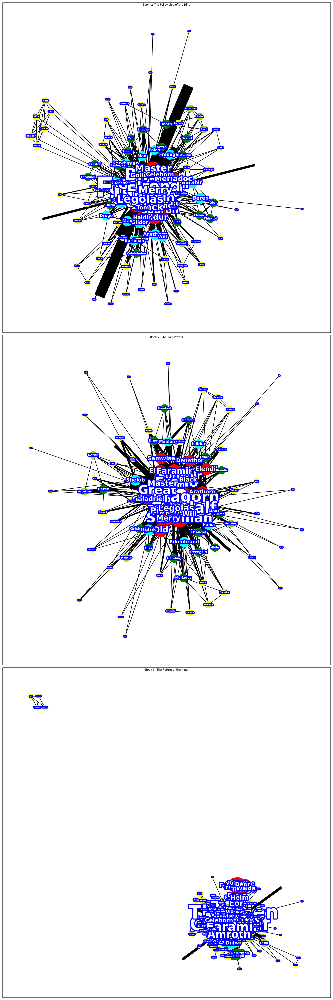

# Network of Rings: Character Interactions in Lord of the Rings 
Network of Rings is a community detection project where I visualized the relationship between Lord of the Ring characters into a graph and determined whether their relationships can be split into isolated communities. 

I assumed that two characters had 1 interaction with each other every time they are mentioned together in a sentence. I created a dictionary to track such interactions and rendered it into a graph using Python NetworkX. The following is the result from Book 1 (The Fellowship of the Ring):

Using the Louvain algorithm, I concluded that character interactions in Book 1 are not divided into clear-cut communities. 

I was inspired by Network of Thrones (https://networkofthrones.wordpress.com/). 
